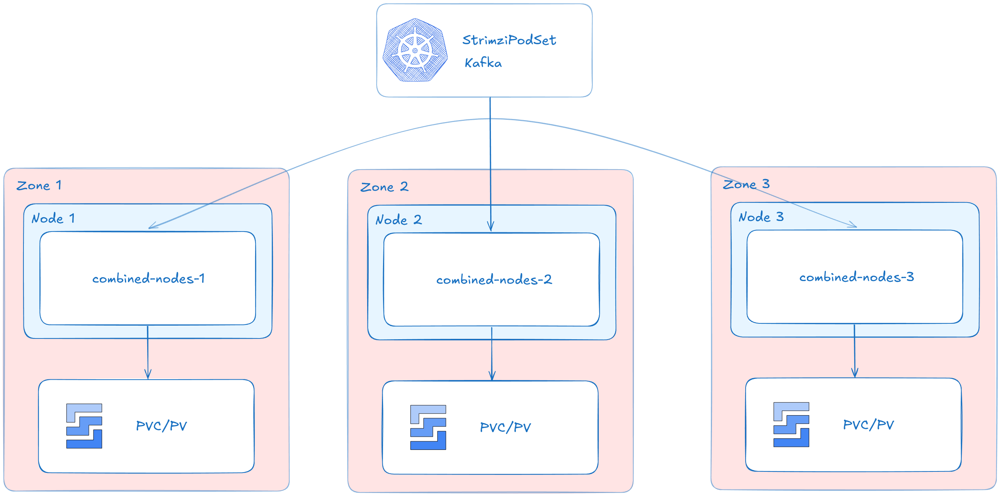
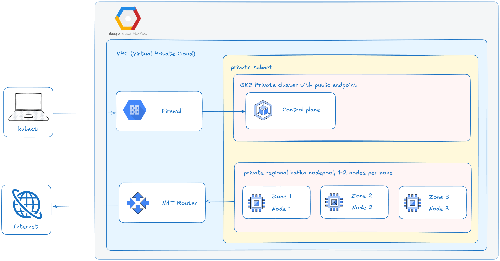

# Deploy Apache Kafka to GKE using Strimzi

This project demonstrates how to deploy Apache Kafka on Google Kubernetes Engine (GKE) using the Strimzi Operator, following modern best practices for security, scalability, and high availability.

The architecture and deployment steps are based on the official Google Cloud tutorial ([Deploy Apache Kafka on GKE with Strimzi](https://cloud.google.com/kubernetes-engine/docs/tutorials/apache-kafka-strimzi)), but have been significantly modified:
- **Zookeeper has been removed** in favor of **KRaft mode**, enabling support for the latest Kafka versions and simplifying cluster management.
- The infrastructure, resource configuration, and security settings have been adapted for smaller workloads (because of free account constraints).

This repository provides a complete, declarative setup for running Kafka on GKE, including Terraform infrastructure provisioning, Kubernetes manifests, and secure client access. All changes and enhancements are documented throughout the codebase and this README.

## Table of Contents

- [Kafka Deployment Architecture](#kafka-deployment-architecture)
- [Prerequisites](#prerequisites)
- [Prepare the environment](#prepare-the-environment)
- [Create your cluster infrastructure](#create-your-cluster-infrastructure)
- [Deploy the Strimzi operator to your cluster](#deploy-the-strimzi-operator-to-your-cluster)
- [Deploy Kafka](#deploy-kafka)
    - [Create Kafka Topics and Users](#create-kafka-topics-and-users)
    - [Test your deployment](#test-your-deployment)

## Kafka Deployment Architecture



This deployment uses Strimzi to run Apache Kafka on a Google Kubernetes Engine (GKE) private cluster, following best practices for high availability, security, and scalability.

- **Private GKE Cluster:** The Kafka brokers run in a private subnet across multiple zones, ensuring resilience against zone failures.
- **Node Pools:** Dedicated node pools are used for Kafka brokers, with pods distributed evenly across zones for fault tolerance.
- **Strimzi Operator:** Strimzi manages the lifecycle of Kafka brokers, topics, and users using custom resources and controllers.
- **Pod Management:** Kafka broker pods are managed by StrimziPodSet resources, which provide advanced rolling update and recovery capabilities.
- **Persistent Storage:** Each broker pod is attached to its own PersistentVolumeClaim (PVC), ensuring durable storage for Kafka data.
- **Networking & Access:** Internal and external Kafka listeners are exposed via Kubernetes Services. Internal clients use the cluster bootstrap service, while external clients connect through a LoadBalancer service with secure authentication.
- **Security:** Communication within the cluster is secured using TLS certificates generated by Strimzi, and client authentication is enforced using SCRAM-SHA-512.
- **Entity Operator:** The entity operator automates topic and user management, enabling declarative configuration and GitOps workflows.

This architecture provides a robust, production-ready foundation for streaming workloads on GKE, with automated management, secure access, and high availability.

## Prerequisites

Before you begin, ensure you have the following tools installed to interact with Google Cloud Platform and Kubernetes:

1. **Google Cloud CLI (`gcloud`)**  
   [Installation guide](https://cloud.google.com/sdk/docs/install)

2. **Kubernetes CLI (`kubectl`)**  
   Install via gcloud:
   ```bash
   gcloud components install kubectl
   ```

3. **Terraform**  
   [Installation guide](https://developer.hashicorp.com/terraform/tutorials/aws-get-started/install-cli)

These tools are required for provisioning infrastructure, managing your Kubernetes cluster, and deploying resources.

## Prepare the environment
1. Create or select a Google Cloud project
- Create a Google Cloud project:
    ```bash
    gloud projects create [PROJECT_ID]
    ```
    Replace [PROJECT_ID] with a name for the Google Cloud project you are creating.
- Select the Google Cloud project that you created:
    ```bash
    gloud config set project [PROJECT_ID]
    ```
2. Set environment variables
    ```
    export PROJECT_ID=[PROJECT_ID]
    export CLUSTER_PREFIX=kafka
    export REGION=asia-southeast1
    ```
3. Clone this repository:
    ```
    git clone https://github.com/luinor223/kafka-gke.git
    ```
4. Change to the working directory:
    ```
    cd kafka-gke/
    ```

## Create your cluster infrastructure

### GKE Cluster Architecture Overview



This architecture uses a Google Kubernetes Engine (GKE) private cluster to provide a secure and scalable foundation for running Kafka and related workloads.

- **Private Cluster**: All worker nodes are deployed in private subnets, inaccessible directly from the public Internet, enhancing security.
- **Public Control Plane Endpoint**: The Kubernetes control plane is accessible via a public endpoint, allowing management with kubectl while keeping workloads isolated.
- **Firewall & NAT Router**: Network traffic is controlled by firewalls and routed through a NAT gateway, enabling secure outbound access for pods without exposing internal resources.
- **Regional Node Pools**: Node pools are distributed across multiple zones for high availability and resilience against zone failures. Autoscaling ensures efficient resource usage.
- **Dedicated Node Pools**: Separate node pools can be used for Kafka brokers and other components, allowing for resource isolation and optimized scheduling.
- **Pod Distribution**: Workloads are spread across zones and nodes to maximize uptime and fault tolerance.

### Deploy the architecture
```bash
export GOOGLE_OAUTH_ACCESS_TOKEN=$(gcloud auth print-access-token)
terraform -chdir=terraform/gke-standard init
terraform -chdir=terraform/gke-standard apply -var project_id=${PROJECT_ID} \
  -var region=${REGION} \
  -var cluster_prefix=${CLUSTER_PREFIX}
```
When prompted, type `yes`. It might take several minutes for this command to complete and for the cluster to show a ready status.

### Connecting to the cluster
```bash
gcloud container clusters get-credentials ${CLUSTER_PREFIX}-cluster --region ${REGION}
```

## Deploy the Strimzi operator to your cluster
1. **Add the Strimzi Helm Chart repository:**
    ```bash
    helm repo add strimzi https://strimzi.io/charts/
    ```
2. **Add a namespace for the Strimzi Operator and the Kafka cluster:**
    ```bash
    kubectl create ns kafka
    ```
3. **Deploy the Strimzi cluster operator using Helm:**
    ```bash
    helm install strimzi-operator strimzi/strimzi-kafka-operator -n kafka
    ```
4. **Verify that the Strimzi Cluster Operator has been deployed successfully using Helm:**
    ```bash
    helm ls -n kafka
    ```

## Deploy Kafka 
After the operator is deployed to the cluster, you are ready to deploy a Kafka cluster instance.

### Basic configuration
The basic configuration for the Kafka instance includes the following components:
- Three replicas of Kafka combined nodes (KRaft mode: a node contain controller +broker), with a minimum of two available replicas required for cluster consistency.
- Three Kafka listeners: one without authentication, one with TLS authentication using certificates generated by Strimzi, and one external listener configured as a LoadBalancer that uses both SCRAM-SHA-512 and TLS for secure client access.
- Java MaxHeapSize and MinHeapSize set to 1536 MB for Kafka.
- CPU resource allocation of 0.5 CPU request and 1 CPU limits both for each of the combined nodes, along with 2 GB memory requests and limits for Kafka
- Entity-operator with the following requests and limits:
    - topicOperator: 100 m/200 m CPU and 512 Mi memory.
    - userOperator: 500 m CPU and 1 Gi memory.
- 20 GB of storage allocated to each Pod using the standard-rwo storageClass.
- Tolerations, nodeAffinities, and podAntiAffinities configured for each workload, ensuring proper distribution across nodes, utilizing their respective node pools and different zones.
- Communication inside the cluster secured by self-signed certificates: separate Certificate Authorities (CAs) for cluster and clients (mTLS).

Note: This configuration represents the minimal setup for development and testing for a free GCP account and is not a production-ready Kafka cluster.

### Create a Kafka cluster
1. **Create a new Kafka cluster using the configuration:**
    ```bash
    kubectl apply -n kafka -f kubernetes/manifests/streaming-kafka-cluster.yaml
    ```
2. **Wait a few minutes while Kubernetes starts the required workloads:**
    ```bash
    kubectl wait kafka/streaming-kafka-cluster --for=condition=Ready --timeout=600s -n kafka
    ```
3. **Verify that the Kafka workloads were created:**
    ```bash
    kubectl get strimzipodset, pod,service,deploy,pdb -l=strimzi.io/cluster=streaming-kafka-cluster -n kafka
    ```
    The output is similar to the following:
    ```bash
    NAME                                                                   PODS   READY PODS   CURRENT PODS   AGE
    strimzipodset.core.strimzi.io/streaming-kafka-cluster-combined-nodes   3      3            3              29h

    NAME                                                           READY   STATUS    RESTARTS   AGE
    pod/streaming-kafka-cluster-combined-nodes-0                   1/1     Running   0          16h
    pod/streaming-kafka-cluster-combined-nodes-1                   1/1     Running   0          16h
    pod/streaming-kafka-cluster-combined-nodes-2                   1/1     Running   0          16h
    pod/streaming-kafka-cluster-entity-operator-6b47855bcc-54sh8   2/2     Running   0          24h

    NAME                                                       TYPE           CLUSTER-IP     EXTERNAL-IP      PORT(S)                                                 AGE
    service/streaming-kafka-cluster-combined-nodes-0           LoadBalancer   10.52.11.159   34.87.3.57       9094:31153/TCP                                          26h
    service/streaming-kafka-cluster-combined-nodes-1           LoadBalancer   10.52.11.91    34.124.161.11    9094:32073/TCP                                          26h
    service/streaming-kafka-cluster-combined-nodes-2           LoadBalancer   10.52.3.124    35.240.163.201   9094:31734/TCP                                          26h
    service/streaming-kafka-cluster-kafka-bootstrap            ClusterIP      10.52.12.114   <none>           9091/TCP,9092/TCP,9093/TCP,9095/TCP                     26h
    service/streaming-kafka-cluster-kafka-brokers              ClusterIP      None           <none>           9090/TCP,9091/TCP,8443/TCP,9092/TCP,9093/TCP,9095/TCP   26h
    service/streaming-kafka-cluster-kafka-external-bootstrap   LoadBalancer   10.52.8.136    34.126.71.37     9094:31225/TCP                                          26h

    NAME                                                      READY   UP-TO-DATE   AVAILABLE   AGE
    deployment.apps/streaming-kafka-cluster-entity-operator   1/1     1            1           26h

    NAME                                                       MIN AVAILABLE   MAX UNAVAILABLE   ALLOWED DISRUPTIONS   AGE
    poddisruptionbudget.policy/streaming-kafka-cluster-kafka   2               N/A               1                     26h
    ```

The operator creates the following resources:
- One StrimziPodSet for Kafka.
- Three Pods for Kafka broker replicas.
- One PodDisruptionBudgets, ensuring a minimum availability of two replicas for cluster consistency.
- A Service named `streaming-kafka-cluster-kafka-bootstrap`, which serves as the bootstrap server for Kafka clients connecting from within the Kubernetes cluster. All internal Kafka listeners are available in this Service.
- A Service named `streaming-kafka-cluster-kafka-external-bootstrap` provides the bootstrap endpoint for Kafka clients connecting from outside the Kubernetes cluster. This Service exposes all external Kafka listeners, enabling secure access for external applications.
- A headless Service named `streaming-kafka-cluster-kafka-brokers` that enables DNS resolution of Kafka broker Pod IP addresses directly. This service is used for inter broker communication.
- A Deployment named `streaming-kafka-cluster-entity-operator` that contains the `topic-operator` and `user-operator` and facilitates the management of custom resources KafkaTopics and KafkaUsers.

### Create Kafka Topics and Users

1. **Create a new Kafka topic**

   For production environments, it is best to pre-create Kafka topics using the Topic Operator. This ensures that each topic is configured with the correct number of partitions, replication factor, retention policy, and other settings, in line with your requirements and best practices.

   ```bash
   kubectl apply -f kubernetes/manifests/topic.yaml
   ```

   This command will create the `trading-prices` topic on your Kafka brokers. You can define additional topics by adding them to `kubernetes/manifests/topic.yaml`.

2. **Create a new Kafka user**

   For production environments where security is important, it is recommended to create dedicated Kafka users with permissions limited to only the specific actions they require. Following the principle of least privilege helps minimize risk and ensures robust access control.

   ```bash
   kubectl apply -f kubernetes/manifests/user.yaml
   ```

   This command will create a `kafka-user` with permission to describe the cluster (such as listing topics) and to create, describe, read, and write to the `trading-prices` topic. You can define additional users and permissions in `kubernetes/manifests/user.yaml`.

3. **Verify topic and user creation**
   ```bash
   kubectl get kafkatopic -n kafka
   kubectl get kafkauser -n kafka
   ```
   You should see your topics and users listed as resources.

### Test your deployment

To verify that your Kafka deployment is working correctly, you can use the provided `kafka-cli.yaml` pod for testing Kafka connectivity from outside the cluster.

1. **Deploy the Kafka CLI pod**
   ```bash
   kubectl apply -f kubernetes/manifests/kafka-cli.yaml
   ```

2. **Open a shell in the pod**
   ```bash
   kubectl exec -it kafka-cli -n kafka -- /bin/sh
   ```

3. **Test producing a message**
   ```bash
   /opt/bitnami/kafka/bin/kafka-console-producer.sh --broker-list streaming-kafka-cluster-kafka-bootstrap:9095 --topic trading-prices --producer.config /tmp/client.properties
   ```
   Type a message (e.g., `hello world`) and press Enter. Use Ctrl+C to exit.

4. **Test consuming a message**
   ```bash
   /opt/bitnami/kafka/bin/kafka-console-consumer.sh --bootstrap-server streaming-kafka-cluster-kafka-bootstrap:9095 --topic trading-prices --consumer.config /tmp/client.properties --from-beginning --max-messages 1
   ```
   You should see the message you produced.

5. **List topics**
   ```bash
   /opt/bitnami/kafka/bin/kafka-topics.sh --list --bootstrap-server streaming-kafka-cluster-kafka-bootstrap:9095 --command-config /tmp/client.properties
   ```

If you can produce and consume messages, your deployment is working!

---
⭐ **Star this repository if you find it helpful!**
